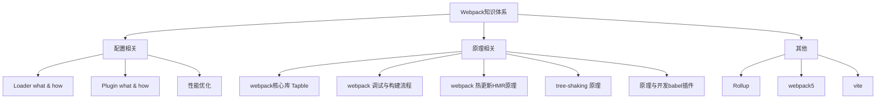

由知识体系可知，
- 基础 -- 会配置
- 进阶 -- 会优化
- 深入 -- 懂原理

通过分层，后面再遇到新的知识可立即加入到这个体系中

## 一、Webpack基础
需要掌握的部分；
1、webpack 的常规配置项有哪些？
2、常用的 Loader 有哪些？如何配置？
3、常用插件（Plugin）有哪些？如何配置？
4、Babel如何配置？Babel插件如何使用？

### 1.1安装依赖
```sh
npm install webpack webpack-cli -D
```
安装完成 ✅
```sh
    "webpack": "^5.75.0",
    "webpack-cli": "^4.10.0"
```
### 1.2工作模式
1、新建 ./src/index.js 文件
```js
const a = 'sun'
console.log(a)
let b = a + ' hello'
console.log(b)
export default b
```


|选项|描述|
|---|---|
|development|开发模式，打包更加快速，省了代码优化步骤
|production|生产模式，打包比较慢，会开启 tree-shaking 和 压缩代码
|none|不使用任何默认优化选项

配置mode(模式)
- 1. 只需在配置对象中提供 mode 选项:
```js
module.exports = {
    mode: 'development',
};
```
- 2. 从 CLI 参数中传递:
```js
npx webpack --mode=development
```

### 1.3配置文件
1. 跟路径下新建一个配置文件 webpack.config.js
2. 新增基本配置信息
```js
const path = require('path')

module.exports = {
    mode: 'development', // 模式
    entry: './src/index.js', // 打包入口地址
    output: {
        filename: 'bundle.js', // 输出文件名
        path: path.join(__dirname, 'dist') // 输出文件目录
    }
}
```
### 1.4Loader
入口改成 CSS 文件
1. 新增 ./src/main.css
```css
body {
    margin: 0 auto;
    padding: 0 20px;
    max-width: 800px;
    background: #f4f8fb;
}
```
2. 修改 entry 配置
```js
const path = require('path')

module.exports = {
  mode: 'development', // 模式
  entry: './src/main.css', // 打包入口地址
  output: {
    filename: 'bundle.css', // 输出文件名
    path: path.join(__dirname, 'dist') // 输出文件目录
  }
}
```
3. 运行打包命令： npx webpack
```sh
ERROR in ./src/main.css 1:5
Module parse failed: Unexpected token (1:5)
You may need an appropriate loader to handle this file type, currently no loaders are configured to process this file. See https://webpack.js.org/concepts#loaders
```
webpack 默认支持处理 JS 与 JSON 文件，其他类型都处理不了，这里必须借助 Loader 来对不同类型的文件的进行处理。
4. 安装css-loader 来处理 css
```sh
npn install css-loader -D
```
5. 配置资源加载模块
```js
const path = require('path')

module.exports = {
    mode: 'development', // 模式
    entry: './src/main.css', // 打包入口地址
    output: {
        filename: 'bundle.css', // 输出文件名
        path: path.join(__dirname, 'dist') // 输出文件目录
    },
    module: { 
        rules: [ // 转换规则
        {
            test: /\.css$/, //匹配所有的 css 文件
            use: 'css-loader' // use: 对应的 Loader 名称
        }]
    }
}
```
6. 重新运行打包命令 npx webpack
尝试完成后，入口文件还是需要改回 ./src/index.js
结论：Loader 就是将 Webpack 不认识的内容转化为认识的内容