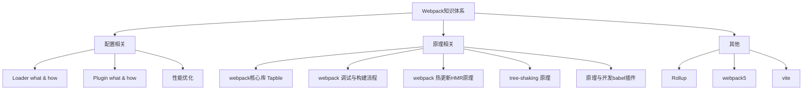

由知识体系可知，
- 基础 -- 会配置
- 进阶 -- 会优化
- 深入 -- 懂原理

通过分层，后面再遇到新的知识可立即加入到这个体系中

## 一、Webpack基础
需要掌握的部分；
1、webpack 的常规配置项有哪些？
2、常用的 Loader 有哪些？如何配置？
3、常用插件（Plugin）有哪些？如何配置？
4、Babel如何配置？Babel插件如何使用？

### 1.1安装依赖
```sh
npm install webpack webpack-cli -D
```
安装完成 ✅
```sh
    "webpack": "^5.75.0",
    "webpack-cli": "^4.10.0"
```
### 1.2工作模式
1、新建 ./src/index.js 文件
```js
const a = 'sun'
console.log(a)
let b = a + ' hello'
console.log(b)
export default b
```


|选项|描述|
|---|---|
|development|开发模式，打包更加快速，省了代码优化步骤
|production|生产模式，打包比较慢，会开启 tree-shaking 和 压缩代码
|none|不使用任何默认优化选项

配置mode(模式)
- 1. 只需在配置对象中提供 mode 选项:
```js
module.exports = {
    mode: 'development',
};
```
- 2. 从 CLI 参数中传递:
```js
npx webpack --mode=development
```

### 1.3配置文件
1. 跟路径下新建一个配置文件 webpack.config.js
2. 新增基本配置信息
```js
const path = require('path')

module.exports = {
    mode: 'development', // 模式
    entry: './src/index.js', // 打包入口地址
    output: {
        filename: 'bundle.js', // 输出文件名
        path: path.join(__dirname, 'dist') // 输出文件目录
    }
}
```
### 1.4Loader
入口改成 CSS 文件
1. 新增 ./src/main.css
```css
body {
    margin: 0 auto;
    padding: 0 20px;
    max-width: 800px;
    background: #f4f8fb;
}
```
2. 修改 entry 配置
```js
const path = require('path')

module.exports = {
  mode: 'development', // 模式
  entry: './src/main.css', // 打包入口地址
  output: {
    filename: 'bundle.css', // 输出文件名
    path: path.join(__dirname, 'dist') // 输出文件目录
  }
}
```
3. 运行打包命令： npx webpack
```sh
ERROR in ./src/main.css 1:5
Module parse failed: Unexpected token (1:5)
You may need an appropriate loader to handle this file type, currently no loaders are configured to process this file. See https://webpack.js.org/concepts#loaders
```
webpack 默认支持处理 JS 与 JSON 文件，其他类型都处理不了，这里必须借助 Loader 来对不同类型的文件的进行处理。
4. 安装css-loader 来处理 css
```sh
npn install css-loader -D
```
5. 配置资源加载模块
```js
const path = require('path')

module.exports = {
    mode: 'development', // 模式
    entry: './src/main.css', // 打包入口地址
    output: {
        filename: 'bundle.css', // 输出文件名
        path: path.join(__dirname, 'dist') // 输出文件目录
    },
    module: { 
        rules: [ // 转换规则
        {
            test: /\.css$/, //匹配所有的 css 文件
            use: 'css-loader' // use: 对应的 Loader 名称
        }]
    }
}
```
6. 重新运行打包命令 npx webpack
尝试完成后，入口文件还是需要改回 ./src/index.js
结论：Loader 就是将 Webpack 不认识的内容转化为认识的内容

### 1.5插件（plugin）
与 Loader 用于转换特定类型的文件不同，插件（Plugin）可以贯穿 Webpack 打包的生命周期，执行不同的任务

1. 新建 ./src/index.html 文件
```html
<!DOCTYPE html>
<html lang="en">
<head>
    <meta charset="UTF-8">
    <meta http-equiv="X-UA-Compatible" content="IE=edge">
    <meta name="viewport" content="width=device-width, initial-scale=1.0">
    <title>ITEM</title>
</head>
<body>
    
</body>
</html>
```
2. 本地安装 html-webpack-plugin
```sh
npm install html-webpack-plugin -D
```
3.配置插件
```js
const path = require('path')
const HtmlWebpackPlugin = require('html-webpack-plugin')

module.exports = {
    mode: 'development', // 模式
    entry: './src/index.js', // 打包入口地址
    output: {
        filename: 'bundle.js', // 输出文件名
        path: path.join(__dirname, 'dist') // 输出文件目录
    },
    module: { 
        rules: [{
            test: /\.css$/, //匹配所有的 css 文件
            use: 'css-loader' // use: 对应的 Loader 名称
        }]
    },
    plugins:[ // 配置插件
        new HtmlWebpackPlugin({
            template: './src/index.html'
        })
    ]
}
```
运行一下打包，打开 dist 目录下生成的 index.html 文件
```html
<!DOCTYPE html>
<html lang="en">
<head>
  <meta charset="UTF-8">
  <meta http-equiv="X-UA-Compatible" content="IE=edge">
  <meta name="viewport" content="width=device-width, initial-scale=1.0">
  <title>ITEM</title>
<script defer src="bundle.js"></script></head>
<body>
  
</body>
</html>
```
可以看到它自动的引入了打包好的 bundle.js ，非常方便实用
### 1.6自动清空打包记录
每次打包的时候，打包目录都会遗留上次打包的文件，为了保持打包目录的纯净，我们需要在打包前将打包目录清空

这里我们可以使用插件 clean-webpack-plugin 来实现
1. 安装
```sh
npm install clean-webpack-plugin -D
```
2. 配置
```js
const path = require('path')
const HtmlWebpackPlugin = require('html-webpack-plugin')
// 引入插件
const { CleanWebpackPlugin } = require('clean-webpack-plugin')

module.exports = {
    plugins:[ // 配置插件
        new HtmlWebpackPlugin({
            template: './src/index.html'
        }),
        new CleanWebpackPlugin() // 引入插件
    ]
}
```
### 1.7区分环境

本地环境：
- 需要更快的构建速度
- 需要打印 debug 信息
- 需要 live reload 或 hot reload 功能
- 需要 sourcemap 方便定位问题
- ...

生产环境：
- 需要更小的包体积，代码压缩+tree-shaking
- 需要进行代码分割
- 需要压缩图片体积
- ...

1. 本地安装[cross-env](https://link.juejin.cn/?target=https%3A%2F%2Fwww.npmjs.com%2Fpackage%2Fcross-env)
```sh
npm install cross-env -D
```
2. 配置启动命令
打开 ./package.json
```js
"scripts": {
    "dev": "cross-env NODE_ENV=dev webpack serve --mode development", 
    "test": "cross-env NODE_ENV=test webpack --mode production",
    "build": "cross-env NODE_ENV=prod webpack --mode production"
},
```
3. 在在 Webpack 配置文件中获取环境变量
```js
const path = require('path')
const HtmlWebpackPlugin = require('html-webpack-plugin')

console.log('process.env.NODE_ENV=', process.env.NODE_ENV) // 打印环境变量

const config = {
  entry: './src/index.js', // 打包入口地址
  output: {
    filename: 'bundle.js', // 输出文件名
    path: path.join(__dirname, 'dist') // 输出文件目录
  },
  module: { 
    rules: [
      {
        test: /\.css$/, //匹配所有的 css 文件
        use: 'css-loader' // use: 对应的 Loader 名称
      }
    ]
  },
  plugins:[ // 配置插件
    new HtmlWebpackPlugin({
      template: './src/index.html'
    })
  ]
}

module.exports = (env, argv) => {
  console.log('argv.mode=',argv.mode) // 打印 mode(模式) 值
  // 这里可以通过不同的模式修改 config 配置
  return config;
}
```
4. 测试一下
- 执行 npm run build
```js
process.env.NODE_ENV= prod
argv.mode= production
```

- 执行 npm run test
```js
process.env.NODE_ENV= test
argv.mode= production
```

- 执行 npm run dev
```js
process.env.NODE_ENV= dev
argv.mode= development
```
这样我们就可以不同的环境来动态修改 Webpack 的配置

### 1.8启动 devServer
1. 安装webpack-dev-server
⚠️注意：本文使用的 webpack-dev-server 版本是 ^4.11.1，当版本 version >= 4.0.0 时，需要使用 devServer.static 进行配置，不再有 devServer.contentBase 配置项。
2. 配置本地服务
```js
// webpack.config.js
const config = {
  devServer: {
    static: [
            {
                directory: path.resolve(__dirname, 'asserts')
            }
        ], // 静态文件目录的绝对｜相对路径
    compress: true, //是否启动压缩 gzip
    port: 8080, // 端口号
    open:true  // 是否自动打开浏览器
  },
}
module.exports = (env, argv) => {
  console.log('argv.mode=',argv.mode) // 打印 mode(模式) 值
  // 这里可以通过不同的模式修改 config 配置
  return config;
}
```
为什么要配置 static ?
webpack 在进行打包的时候，对静态文件的处理，例如图片，都是直接 copy 到 dist 目录下面。但是对于本地开发来说，这个过程太费时，也没有必要，所以在设置 contentBase 之后，就直接到对应的静态目录下面去读取文件，而不需对文件做任何移动，节省了时间和性能开销。
3. 启动本地服务
```sh
npm run dev
```
为了看到效果，我在 html 中添加了一段文字，并在 public 下面放入了一张图片 logo.png
```html
<!DOCTYPE html>
<html lang="en">
<head>
  <meta charset="UTF-8">
  <meta http-equiv="X-UA-Compatible" content="IE=edge">
  <meta name="viewport" content="width=device-width, initial-scale=1.0">
  <title>ITEM</title>
</head>
<body>
  <p>ITEM</p>
</body>
</html>
```
```js
public       
└─ logo.png  
```

打开地址 http://localhost:8080/

访问访问 http://localhost:8080/logo.png

直接显示，则成功

### 1.9引入 CSS
Loader 里面讲到了使用 css-loader 来处理 css，但是单靠 css-loader 是没有办法将样式加载到页面上。这个时候，我们需要再安装一个 style-loader 来完成这个功能
style-loader 就是将处理好的 css 通过 style 标签的形式添加到页面上
1. 安装 [style-loader](https://link.juejin.cn/?target=https%3A%2F%2Fwww.npmjs.com%2Fpackage%2Fstyle-loader)
```sh
npm install style-loader -D
```
2. 配置 Loader
```js
const config = {
  module: { 
    rules: [
      {
        test: /\.css$/, //匹配所有的 css 文件
        use: ['style-loader','css-loader']
      }
    ]
  },
}
```
⚠️注意： Loader 的执行顺序是固定从后往前，即按 css-loader --> style-loader 的顺序执行
3. 引用样式文件
在入口文件 ./src/index.js 引入样式文件 ./src/main.css
```js
// ./src/index.js
import './main.css';

const a = 'Hello ITEM'
console.log(a)
module.exports = a;
```

```js
/* ./src/main.css */ 
body {
  margin: 10px auto;
  background: cyan;
  max-width: 800px;
}
```
4. 重启本地服务, 访问 http://localhost:8080/
这样样式就起作用了，继续修改一下样式
```css
body {
  margin: 10px auto;
  background: cyan;
  max-width: 800px;
  /* 新增 */
  font-size: 46px;
  font-weight: 600;
  color: white;
  position: fixed;
  left: 50%;
  transform: translateX(-50%);
}
```
保存之后，样式就自动修改完成了

style-loader 核心逻辑相当于：
```js
const content = `${样式内容}`
const style = document.createElement('style');
style.innerHTML = content;
document.head.appendChild(style);
```
通过动态添加 style 标签的方式，将样式引入页面

1.10 CSS 兼容性
使用 postcss-loader，自动添加 CSS3 部分属性的浏览器前缀
上面我们用到的 transform: translateX(-50%);，需要加上不同的浏览器前缀，这个我们可以使用 postcss-loader 来帮助我们完成
```js
npm install postcss postcss-loader postcss-preset-env -D
```
添加 postcss-loader 加载器
```js
const config = {
  // ...
  module: { 
    rules: [
      {
        test: /\.css$/, //匹配所有的 css 文件
        use: ['style-loader','css-loader', 'postcss-loader']
      }
    ]
  },
  // ...
}
```

创建 postcss 配置文件 postcss.config.js
```js
// postcss.config.js
module.exports = {
  plugins: [require('postcss-preset-env')]
}
```

创建 postcss-preset-env 配置文件 .browserslistrc
```sh
# 换行相当于 and
last 2 versions # 回退两个浏览器版本
> 0.5% # 全球超过0.5%人使用的浏览器，可以通过 caniuse.com 查看不同浏览器不同版本占有率
IE 10 # 兼容IE 10
```
再尝试运行一下

1.11 引入 Less 或者 Sass
less 和 sass 同样是 Webpack 无法识别的，需要使用对应的 Loader 来处理一下
|文件类型|loader|
|---|---|
|Less|	less-loader|
|Sass|	sass-loader node-sass 或 dart-sass|
Less 处理相对比较简单，直接添加对应的 Loader 就好了
Sass 不光需要安装 sass-loader 还得搭配一个 node-sass，这里 node-sass 建议用淘宝镜像来安装，npm 安装成功的概率太小了 🤣
这里我们就使用 Sass 来做案例
1. 安装
```js
npm install sass-loader -D
# 淘宝镜像
npm i node-sass --sass_binary_site=https://npm.taobao.org/mirrors/node-sass/
```
2. 新建 ./src./sass.css
Sass 文件的后缀可以是 .scss(常用) 或者 .sass
```js
$color: rgb(190, 23, 168);

body {
  p {
    background-color: $color;
    width: 300px;
    height: 300px;
    display: block;
    text-align: center;
    line-height: 300px;
  }
}
```
3. 引入 Sass 文件
```js
import './main.css';
import './sass.scss' // 引入 Sass 文件


const a = 'Hello ITEM'
console.log(a)
module.exports = a;
```
4. 修改配置
```js
const config = {
   // ...
   rules: [
      {
        test: /\.(s[ac]|c)ss$/i, //匹配所有的 sass/scss/css 文件
        use: [
          'style-loader',
          'css-loader',
          'postcss-loader',
          'sass-loader', 
        ]
      },
    ]
  },
  // ...
}
```
执行
